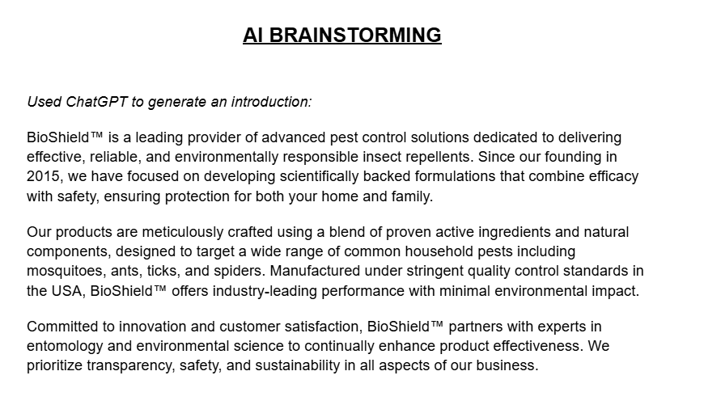

**Reflection**

GitHub:
https://github.com/CartWebApp/bio-shield-website-nightshift 

Website:
https://bioshieldwebsite.netlify.app/

Tools used:
- ChatGPT
- Adobe Firefly
- Adobe Photoshop

Used ChatGPT to generate an introduction:

AI generated logo and products, then photoshopped:

Design Philosophies:

- Nature Pictures
- Different Products
- Preview Images
- Simple images
- Footer at the bottom of the wesbite showing other page links
- FAQ's?
- Explaining how good [your] product is and show a description
- "Back to top" button

**Summary**

In this project I tried researching different websites that showed a lot of unique designs such as simplicit images, round edges, displaying products, and a lot more. We could have done more if we wanted to, but it was best to try to keep things simple enough. Although for me, I didn't do much of the coding; instead I focused more on giving introductions and products. The introductions were easy to do since all we needed was a summary then we could break it down to read. For the products, I spent most of my time finding a design and photoshopping all the products. I feel like I could have done more and I wish I felt more productive while we worked on this, but I'm still learning to code so it was good to see where I'm at. Despite not doing majority of the coding, I found myself more fascinated with editing the products and designing the logo. 