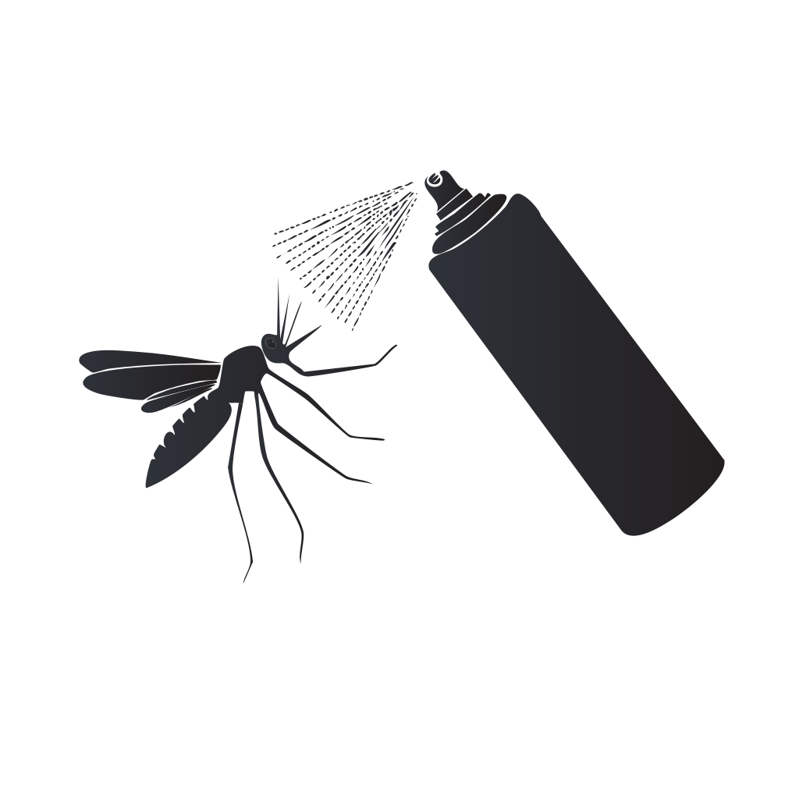

# **Collaboration Document**

Github:

<https://github.com/CartWebApp/bio-shield-website-nightshift> 

Website:

<https://bioshieldwebsite.netlify.app/>

\
\
\
\
\
\

## **Design Philosophies:**

Rounded Corners

Color theme

Nature pictures

Set Color Pallette  

Different products

Preview image changes when hovered over

Simplistic graphics (Preferably Vectors/SVG)

Bottom of page showing links to other pages/partners

\

Customer reviews

\

FAQ’s?

Explain how good \[your] product is and what it’s used for

Zoom in on shop image hover

descroption

Back to top button? (Also drop shadows)

Information on bug spray/outdoor protection in general

Address common issues?

\
\

Advertise products

**Documented use of AI**

1. Used Adobe Firefly to generate and edit SVG files

Final Images:   

2. Chat logs: 

|                                                                                               |          |                    |   |
| :-------------------------------------------------------------------------------------------: | :------: | :----------------: | - |
|                                            **Name**                                           | **Type** |   **Date shared**  |   |
|       [Contact form fix](https://chatgpt.com/share/68cdce44-908c-800f-b556-e80588b0e27e)      |   Chat   | September 19, 2025 |   |
|      [Add product pages](https://chatgpt.com/share/68cdce3e-527c-800f-9838-3c1a1e70851a)      |   Chat   | September 19, 2025 |   |
|    [Product page creation](https://chatgpt.com/share/68cdce38-b2ec-800f-97ae-f38c178f7955)    |   Chat   | September 19, 2025 |   |
|     [Fix footer placement](https://chatgpt.com/share/68cdce31-369c-800f-9fdb-90d65ce07e2f)    |   Chat   | September 19, 2025 |   |
|    [Dark mode button code](https://chatgpt.com/share/68cdce24-b604-800f-950e-155ce7cdc854)    |   Chat   | September 19, 2025 |   |
|    [Products page creation](https://chatgpt.com/share/68cc6896-0c9c-800f-ae35-b76f3f5af24c)   |   Chat   | September 18, 2025 |   |
|     [Contact us page code](https://chatgpt.com/share/68cc6885-cbac-800f-bfc0-b5a39a0e47b8)    |   Chat   | September 18, 2025 |   |
|     [About us page design](https://chatgpt.com/share/68cc687a-871c-800f-b20c-dc661ae39c68)    |   Chat   | September 18, 2025 |   |
| [Add white square background](https://chatgpt.com/share/68cc686b-e9bc-800f-b862-ad5b7d784342) |   Chat   | September 18, 2025 |   |
|   [Fix product page layout](https://chatgpt.com/share/68cc685a-6574-800f-bc54-4842d9c932ed)   |   Chat   | September 18, 2025 |   |
|      [Back to top button](https://chatgpt.com/share/68cc67c4-39f0-800f-8df3-3be293bd8da1)     |   Chat   | September 18, 2025 |   |
|   [Edit website navigation](https://chatgpt.com/share/68c49283-aea0-800f-bf87-aef8ae9625e9)   |   Chat   | September 12, 2025 |   |

**Design Choices**

\
\

Color Palette

# **Reflection**

Tools I used: 

- ChatGPT

- Adobe Firefly

- Adobe Illustrator

\

Thinking Process

Going into this project, I had a specific idea of what to do in mind, and after researching other bug repellent sites I knew I wanted to go for a more corporate look to go more into the professional side of bug repellents, as it seemed there wasn't any other company doing that, and it seemed nice to have a more minimalistic take on the products, as if Google or Apple was doing it. ChatGPT was a huge help. Of course, I had to edit certain things it spat out, but this project likely would not be possible without it, or at least it would look wildly different. ChatGPT dealt with a lot of the CSS, while I mostly filled in the information, fixed up gaps in its illusions, and wove everything together through the navigation. The overall formatting of the site was also suggested by me, but written by ChatGPT. Overall, I am somewhat disappointed with myself on how useless I was at making my own design, as ChatGPT did most of the work. However, I learned a lot from this project, even just watching the AI work and fixing its errors gave me enough knowledge to hopefully make a functional website on my own.
